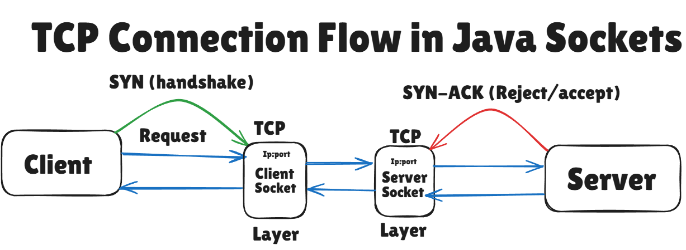
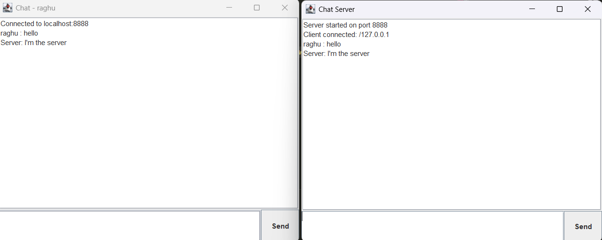

# Java Chat Application (Client-Server)

A simple **client-server chat application** built using Java. It demonstrates the use of **network programming**, **multi-threading**, and **GUI development** with **Swing**.

---

## 📚 Educational Purpose

This project is designed to help students and beginners understand the following Java concepts:

### 🔧 Core Java Concepts Used

| Concept                  | Description |
|--------------------------|-------------|
| `Socket` / `ServerSocket` | Network communication between client and server |
| `ObjectInputStream` / `ObjectOutputStream` | Sending and receiving objects (strings) over the network |
| `Thread` / `Runnable`    | Handling multiple clients concurrently |
| `ArrayList`              | Managing connected clients |
| `synchronized`           | Thread-safe operations on shared resources |
| `try-with-resources`     | Proper resource management (especially streams and sockets) |
| `Swing` (e.g., `JFrame`, `JTextArea`, `JButton`) | GUI components for client and server chat windows |
| `ActionListener`         | Button click event handling |
| `SwingUtilities.invokeLater` | Ensuring GUI updates run on the Event Dispatch Thread |
| `BorderLayout` / `JPanel` | GUI layout management |
| `JOptionPane`            | Prompting for user input (e.g., name entry) |
---
### Diagramatic representation

## 💡 Features
- Multi-client support using threads
- Real-time broadcasting of messages
- Server can send messages too
- Simple GUI using Java Swing
- Graceful disconnection of clients
---
## 🧱 Requirements

- Java 8 or higher
- No external libraries needed

---

## 🚀 How to Run

### 1. Compile the code:

```bash
javac ChatServer.java ChatClient.java
```
### 2. Run the server:
```bash
java ChatServer
```
### 3. Run the client(s):
```bash
java ChatClient
```
---
### Output

---
### 📁 Files
ChatServer.java – Server application (with GUI)
ChatClient.java – Client application (with GUI)
README.md – Project overview and instructions
---
### 📝 Notes
Default port is 8888. You can change it in the code.
Server must run before clients connect.
All messages are broadcasted to every connected client.
Written for learning and demonstration purposes.
---
### 📌 License
This project is free to use, modify, and distribute for educational purposes.
---
